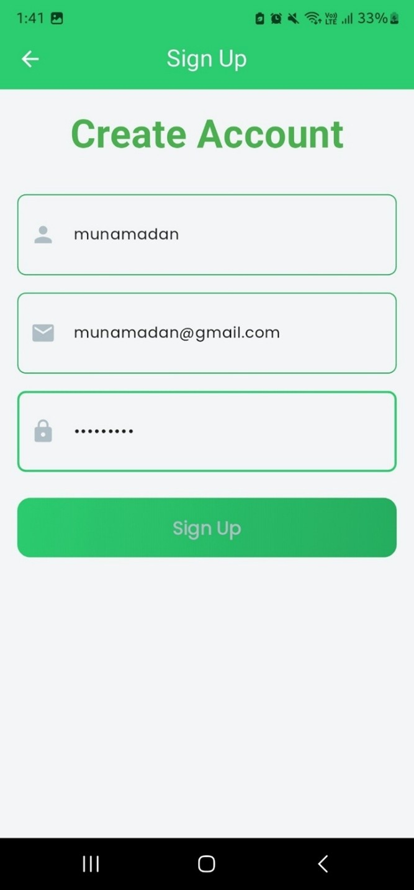
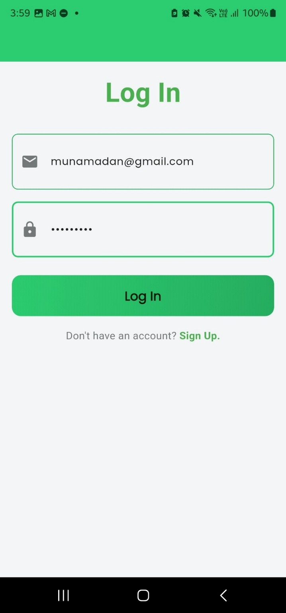
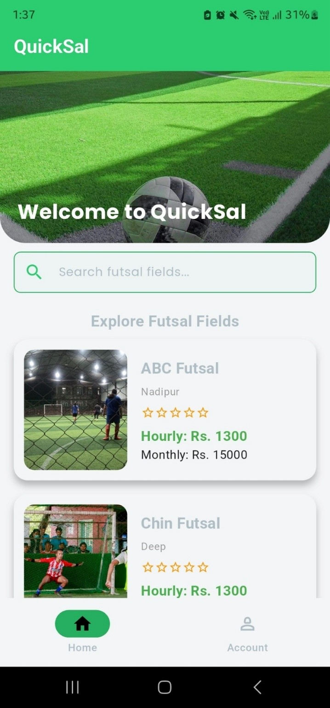
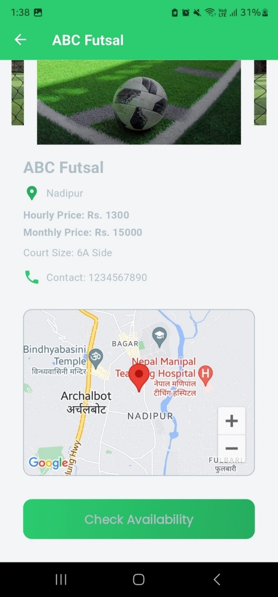
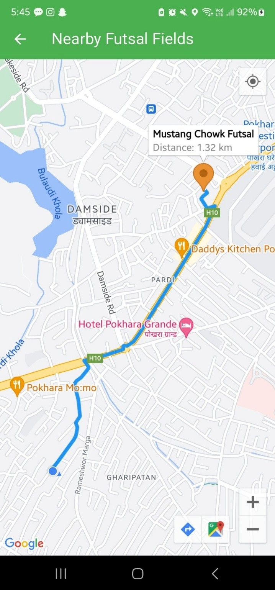
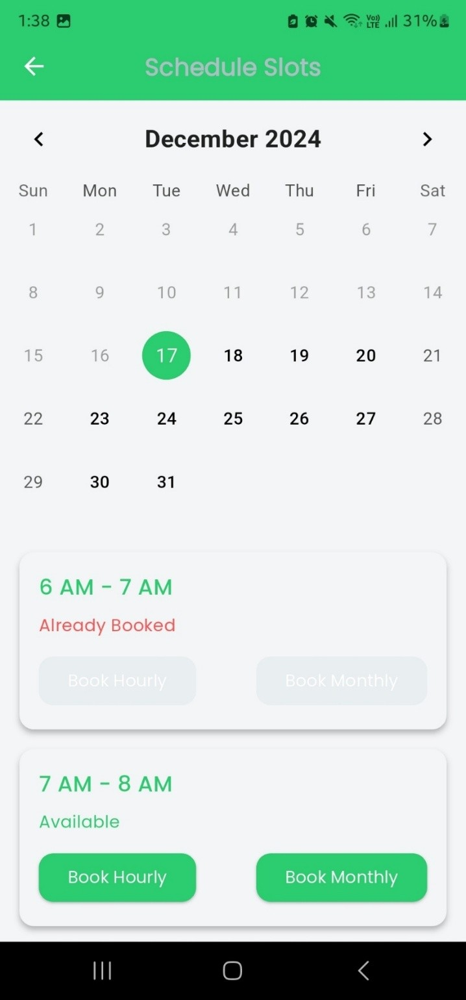
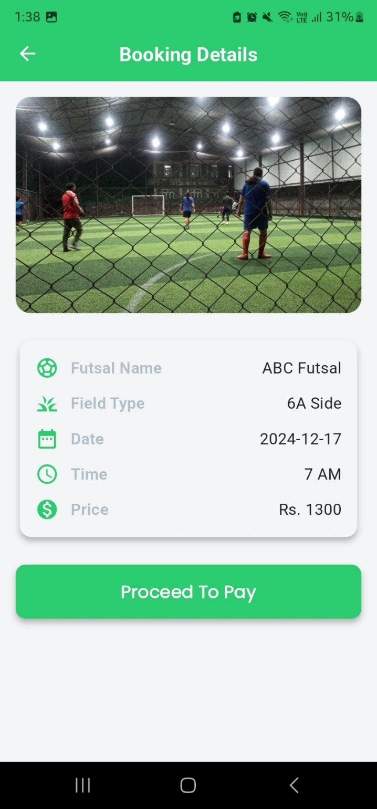
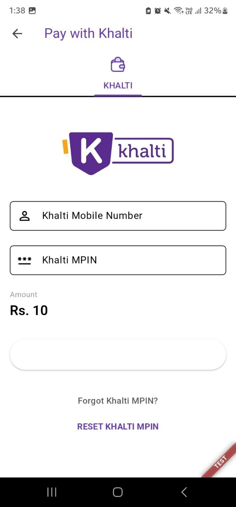
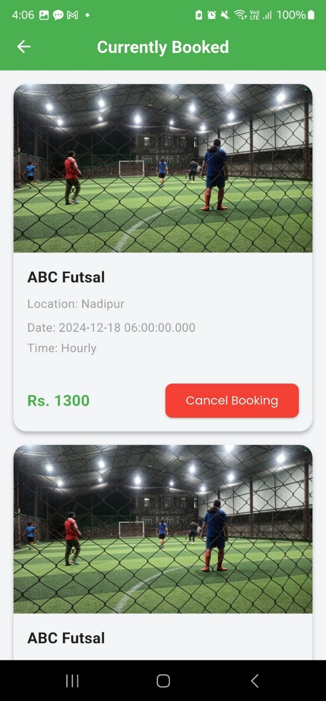

# futsal_booking_app

This system is designed to streamline the booking process, provide real-time availability of the futsal field, and offer users a platform to organize games with ease.
The platform will be beneficial for both players and futsal field owners. Players will be able to search for available fields, and book them in advance, saving their valuable time.
For field owners, the system will provide tools to manage bookings, track payments, and optimize field usage. With these features, the Futsal management system aims to make playing futsal more accessible, enjoyable, and efficient.

# UI

